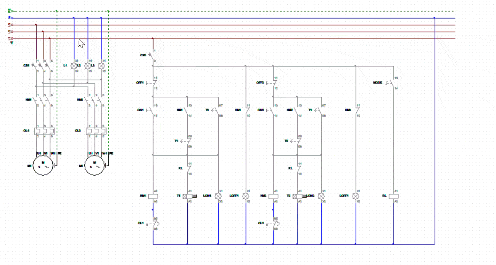

# ⚡ Sequential Control System for Two 3-Phase Induction Motors

A complete industrial electrical control system for sequential starting of two 3-phase induction motors based on time intervals, integrated with **EOCR (Electronic Overcurrent Relay)** overload protection. Designed and simulated using **CADe SIMU**.

---

## 📌 Project Overview
- **Application:** Industrial Automation / Motor Control Systems / Power Distribution
- **Simulation Software:** CADe SIMU v4.0
- **Target Hardware:** 3-Phase Induction Motors, Contactors, On-Delay Timers, EOCR Relays, Push Buttons, Indicator Lamps

---

## 🎬 Simulation Demonstration



---

## 📐 System Architecture & Operation Principle

### 1. Power Circuit 
- **Main Breakers (CB1):** Provides short-circuit protection for the main power line.
- **Contactors (KM1, KM2):** Controls power supply to Motor 1 (M1) and Motor 2 (M2).
- **Overload Relays (OL1, OL2 / EOCR):** Independent electronic overcurrent protection for each motor.

### 2. Control Sequence Logic
1. **Motor 1 Start:** Pressing ON1 energizes Contactor KM1 and On-Delay Timer T1. Motor M1 starts immediately.
2. **Time Delay Transition:** T1 counts down the preset time delay interval.
3. **Motor 2 Automatic Start:** Upon timer completion, timed contacts trigger Contactor KM2, automatically starting Motor M2.
4. **Independent & Emergency Stop:** OFF1 and OFF2 allow independent or sequential shutdown of the motors.
5. **Overload Protection:** If either motor experiences an overload condition, the corresponding EOCR auxiliary contact (OL1 / OL2) trips, disconnecting the control circuit and halting the motor safely.

---

## 🚀 How to Run the Simulation
Download and launch CADe SIMU (Default Access Code: 4962).

Clone or download this repository:

Bash
git clone [https://github.com/thienquy-nguyen/sequential-motor-control-cade-simu.git](https://github.com/thienquy-nguyen/sequential-motor-control-cade-simu.git)
Open the du_an_1 file in CADe SIMU.

Press Play (Simulation Mode) to interact with push buttons and test the sequential sequence.

✉️ Contact & Portfolio
Thien Quy Nguyen

Automation & Control Engineering Student | Vietnam Aviation Academy (VAA)

Email: quy.nguyen.eng@gmail.com

LinkedIn: Thien Quy Nguyen

GitHub: thienquy-nguyen

## 📂 Repository Structure

```text
├── du_an_1                   # CADe SIMU source file
├── sequential-motor-control-cade-simu.gif  # Simulation demonstration GIF
└── README.md                 # Project documentation
